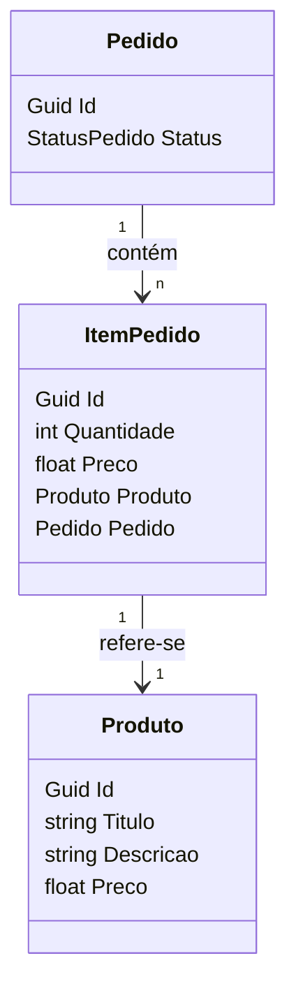

# API de Pedidos

API .NET de pedidos simples implementada usando os principios do Domain-Driven Design (DDD), construida com .NET Core, Entity Framework Core, xUnit, e Docker.

## Sumário

- [Primeiros passos](#primeiros-passos)
- [Recursos](#recursos)
- [Diagrama de Entidade e Relacionamento](#diagrama-entidade-relacionamento)
- [Endpoints](#endpoints)
- [Licença](#licença)

## Primeiros passos

### Executando com Docker

A maneira mais fácil de executar a aplicação é com Docker.

```bash
docker-compose up -d
```

> A aplicação estará disponível em [https://localhost:5077](https://localhost:5077).

### Executando com .NET CLI

Como alternativa, você pode executar a aplicação com a CLI do .NET.

#### Pré-requisitos

- [.NET Core](https://dotnet.microsoft.com/download)

```bash
dotnet run --project API/API.csproj
```

> A aplicação estará disponível em [https://localhost:5077](https://localhost:5077).

## Recursos

O aplicativo inclui as seguintes funcionalidades:

- Arquitetura limpa e DDD
- Entity Framework Core
- Entity Framework Core InMemory
- Testes unitários com xUnit
- Swagger UI
- Dockerfile and docker-compose.yml

## Diagrama Entidade Relacionamento

O seguinte Diagrama Entidade-Relacionamento (DER) mostra os relacionamentos entre as entidades na aplicação:



## Endpoints

### Produtos

- `POST /api/produtos`: Adiciona um novo produto.
- `GET /api/produtos`: Retorna todos os produtos.
- `GET /api/produtos/{id}`: Retorna um produto por ID.
- `PUT /api/produtos/{id}`: Atualiza um produto por ID.
- `DELETE /api/produtos/{id}`: Deleta um produto por ID.

### Pedidos

- `POST /api/pedidos`: Adiciona um novo pedido.
- `GET /api/pedidos`: Retorna todos os pedidos.
- `GET /api/pedidos/{id}`: Retorna um pedido por ID.
- `DELETE /api/pedidos/{id}`: Deleta um pedido por ID.
- `POST /api/pedidos/{id}/close`: Fecha um pedido.

### Itens do Pedido

- `POST /api/pedidos/{id}/itens`: Adiciona um novo item ao pedido.
- `GET /api/pedidos/{id}/itens`: Retorna todos os itens do pedido.
- `GET /api/pedidos/{id}/itens/{produtoId}`: Retorna um item do pedido pelo ID do produto.
- `PUT /api/pedidos/{id}/itens/{produtoId}`: Atualiza um item do pedido pelo ID do produto.
- `DELETE /api/pedidos/{id}/itens/{produtoId}`: Deleta um item do pedido pelo ID do produto.

## Licença

Este projeto está licenciado sob a licença MIT - consulte o arquivo [LICENSE](./LICENSE) para obter detalhes.
